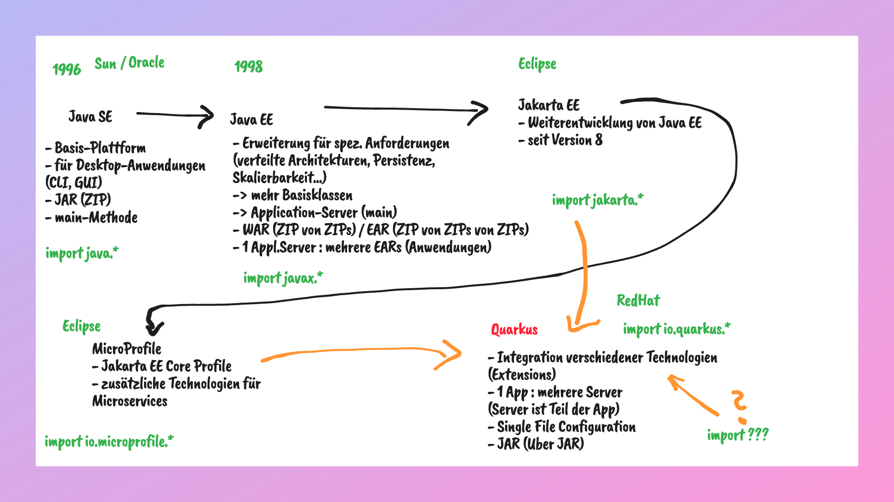

# Skizzen und Links

## Einführung
- [Java EE Technologies](https://www.oracle.com/java/technologies/javaee/javaeetechnologies.html)
- [Jakarta EE](https://jakarta.ee/)
- [MicroProfile](https://microprofile.io/)
- [Quarkus](https://quarkus.io/)
  - [Code Starter](https://code.quarkus.io/)
  - [Projekt mit Maven anlegen](https://quarkus.io/guides/getting-started)

## Testen

## REST
- [Original-Dissertation](https://ics.uci.edu/~fielding/pubs/dissertation/rest_arch_style.htm)
- [Zalando Guidelines](https://opensource.zalando.com/restful-api-guidelines/)

- 

## Dependency Injection

- [CDI (Jakarta EE)](https://jakarta.ee/specifications/cdi/4.1/jakarta-cdi-spec-4.1)
- [Quarkus Arc](https://quarkus.io/guides/cdi-reference)

## Interceptors

- [Interceptors (Jakarta EE)](https://jakarta.ee/specifications/interceptors/2.2/jakarta-interceptors-spec-2.2)

## Schichtenarchitektur

- [Motivation für Clean Architecture (Blog von Uncle Bob)](https://blog.cleancoder.com/uncle-bob/2016/01/04/ALittleArchitecture.html)

## Datenbankzugriffe

- [JDBC Sample](https://www.tutorialspoint.com/jdbc/jdbc-sample-code.htm)
- [JPA Sample](https://www.vogella.com/tutorials/JavaPersistenceAPI/article.html)
- [Quarkus Dev Services for Databases](https://quarkus.io/guides/databases-dev-services)

